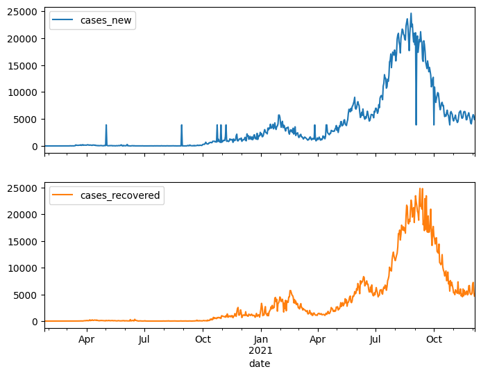

This repository contains a comprehensive dataset on COVID-19, which includes various statistics related to the pandemic, including cases, deaths, recoveries, and testing rates in Malaysia. 
The year 2020 was a catastrophic year for humanity. Pneumonia of unknown etiology was first reported in December 2019., since then, COVID-19 spread to the whole world and became a global pandemic. More than 200 countries were affected due to pandemic and many countries were trying to save precious lives of their people by imposing travel restrictions, quarantines, social distances, event postponements and lockdowns to prevent the spread of the virus. However, due to lackadaisical attitude, efforts attempted by the governments were jeopardized, thus, predisposing to the wide spread of virus and loss of lives. The scientists believed that the absence of AI assisted automated tracking and predicting system is the cause of the wide spread of COVID-19 pandemic. 

Hence, the scientist proposed the usage of deep learning model to predict the daily COVID cases to determine if travel bans should be imposed or rescinded. 

This coding is a single-step single-output problem. With an input window width of 30, output window width of 30 and an offset of 1. Then, MLflow deployed to help streamline machine learning workflow, where best training results from MLflow run is displayed.

The project's objective is to forecast the Malaysia's Covid-19 cases trend.
The data is provided through an official GitHub page by Ministry of Health (MoH) Malaysia. The link to the GitHub page will be provided in the credit section below.
The dataset contains anomalies such as 2 different types of NaNs (which imputed by using df.interpolate()), but no duplicate data.

The layers used for the deep learning model are consist of only three layers, input layer, LSTM layer and output layer.

